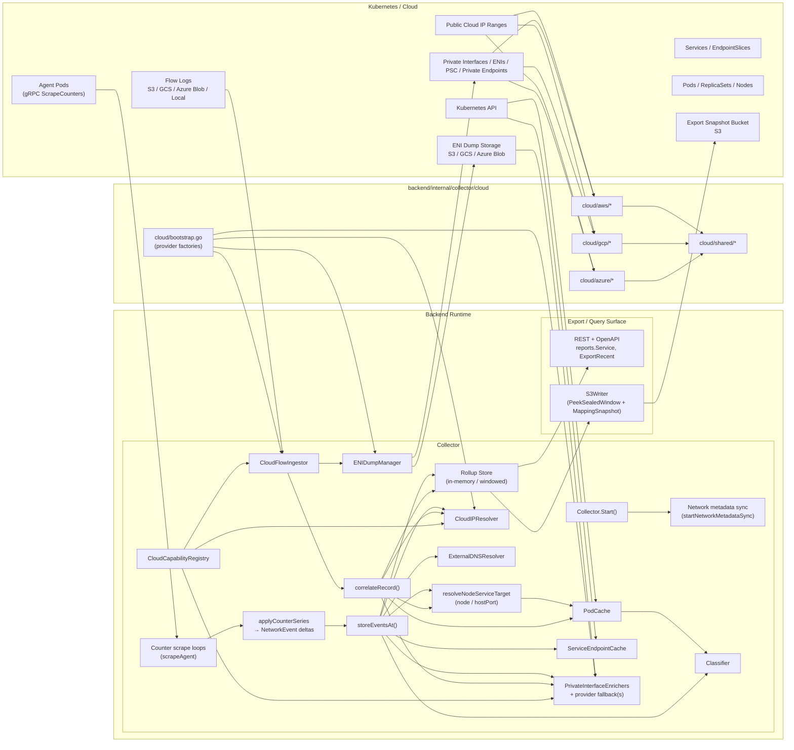

# New Page222a

Start writing here. 342 123sdf sdf

and here.

asdasdasda ssdfssd sf

sdgf232134asda asdas

new stuff

```mermaid
flowchart LR
    subgraph K8s["Kubernetes / Cloud"]
        Agents["Agent Pods\n(gRPC ScrapeCounters)"]
        API["Kubernetes API"]
        Services["Services / EndpointSlices"]
        Pods["Pods / ReplicaSets / Nodes"]
        PublicCloud["Public Cloud IP Ranges"]
        PrivateCloud["Private Interfaces / ENIs / PSC / Private Endpoints"]
        FlowStorage["Flow Logs\nS3 / GCS / Azure Blob / Local"]
        DumpStorage["ENI Dump Storage\nS3 / GCS / Azure Blob"]
        ExportBucket["Export Snapshot Bucket\nS3"]
    end

    subgraph Backend["Backend Runtime"]
        subgraph Collector["Collector"]
            Start["Collector.Start()"]
            NetMeta["Network metadata sync\n(startNetworkMetadataSync)"]
            ScrapeLoops["Counter scrape loops\n(scrapeAgent)"]
            ScrapeDeltas["applyCounterSeries\n→ NetworkEvent deltas"]
            StoreEvents["storeEventsAt()"]
            NodeResolve["resolveNodeServiceTarget\n(node / hostPort)"]
            Classifier["Classifier"]
            PodCache["PodCache"]
            ServiceCache["ServiceEndpointCache"]
            PublicResolver["CloudIPResolver"]
            PrivateResolver["PrivateInterfaceEnrichers\n+ provider fallback(s)"]
            ExtDNS["ExternalDNSResolver"]
            Capabilities["CloudCapabilityRegistry"]
            FlowIngestor["CloudFlowIngestor"]
            Correlator["correlateRecord()"]
            ENIDump["ENIDumpManager"]
            RollupStore["Rollup Store\n(in-memory / windowed)"]
        end

        subgraph ExportSurface["Export / Query Surface"]
            ReportsREST["REST + OpenAPI\nreports.Service, ExportRecent"]
            S3Export["S3Writer\n(PeekSealedWindow + MappingSnapshot)"]
        end
    end

    subgraph CloudPkg["backend/internal/collector/cloud"]
        Bootstrap["cloud/bootstrap.go\n(provider factories)"]
        AWS["cloud/aws/*"]
        GCP["cloud/gcp/*"]
        Azure["cloud/azure/*"]
        Shared["cloud/shared/*"]
    end

    Start --> NetMeta
    FlowIngestor --> ENIDump

    Agents --> ScrapeLoops
    ScrapeLoops --> ScrapeDeltas
    ScrapeDeltas --> StoreEvents

    API --> PodCache
    API --> ServiceCache
    PublicCloud --> AWS
    PublicCloud --> GCP
    PublicCloud --> Azure
    PrivateCloud --> AWS
    PrivateCloud --> GCP
    PrivateCloud --> Azure

    PodCache --> Classifier
    StoreEvents --> Classifier
    StoreEvents --> NodeResolve
    NodeResolve --> PodCache
    StoreEvents --> ServiceCache
    StoreEvents --> PublicResolver
    StoreEvents --> PrivateResolver
    StoreEvents --> ExtDNS
    StoreEvents --> RollupStore

    FlowStorage --> FlowIngestor
    FlowIngestor --> Correlator
    Correlator --> PodCache
    Correlator --> NodeResolve
    Correlator --> PrivateResolver
    Correlator --> PublicResolver
    Correlator --> RollupStore

    ENIDump --> PrivateCloud
    ENIDump --> DumpStorage
    DumpStorage --> PrivateResolver

    RollupStore --> ReportsREST
    RollupStore --> S3Export
    S3Export --> ExportBucket
    Capabilities --> FlowIngestor
    Capabilities --> PublicResolver
    Capabilities --> PrivateResolver
    Bootstrap --> PublicResolver
    Bootstrap --> FlowIngestor
    Bootstrap --> ENIDump
    Bootstrap --> PrivateResolver
    AWS --> Shared
    GCP --> Shared
    Azure --> Shared
```
